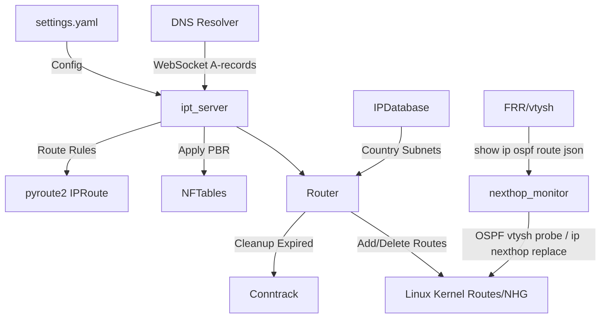

### 1. `README.md` (General overview)

# ipt_server

`ipt_server` is a Python-based service designed for dynamic network routing management, integrating Policy-Based Routing (PBR), WireGuard VPN support, and real-time DNS-based route updates via WebSocket. It leverages `pyroute2` for route manipulation, `nftables` for traffic filtering, and an interval tree for efficient route conflict resolution. The service is ideal for scenarios requiring flexible traffic routing based on domains, countries, or specific subnets.

## Features
- **Dynamic Routing**: Add and remove routes based on DNS A-records received over WebSocket.
- **Policy-Based Routing (PBR)**: Direct traffic through specified interfaces using `fwmark` and custom routing tables.
- **TTL Management**: Automatically expire routes with configurable time-to-live (TTL) settings.
- **NHG Failover**: Each route action group maps to a kernel nexthop group (nhg); `nexthop_monitor` keeps exactly one member active, switching via OSPF liveness checks.
- **Country-Based Routing**: Route traffic for entire countries using IP ranges from the DB-IP database.

## Architecture

The following diagram illustrates the high-level architecture of `ipt_server`:



- **DNS Resolver**: Sends A-records to `ipt_server` via WebSocket.
- **ipt_server**: Core service handling configuration, WebSocket, and PBR.
- **Router**: Manages route lifecycle and conflict resolution.
- **Linux Kernel Routes/NHG**: Stores active routes and nexthop groups manipulated via `pyroute2`.
- **NFTables**: Filters traffic based on PBR rules.
- **IPDatabase**: Provides subnet data for country-based routing.
- **nexthop_monitor**: Polls OSPF via `vtysh` every 5 s to determine `gw=` member liveness; switches the active nhg member via `ip nexthop replace` when liveness changes.
- **FRR/vtysh**: Provides OSPF route state used by `nexthop_monitor` to assess gateway reachability.

## Routing Principles

1. **Grouped config**: Route config groups match rules (`domain`, `country`, `net`) under an ordered list of member actions (`gw=`, `dev=`).
2. **One nhg per action group**: At startup each action group is realised as a single kernel nexthop group object (proto 199). All kernel routes that belong to that group reference the same nhid — one consistent code path.
3. **Single active member**: The nhg always has exactly one active member — the highest-priority member whose liveness check currently passes.
4. **`gw=` liveness**: Checked by querying `vtysh "show ip ospf route json"` for the presence of an external `0.0.0.0/0` route. Absent → gateway considered dead → member blackholed.
5. **`dev=` liveness**: Checked by confirming the named interface is present in the kernel interface list.
6. **Failover mechanism**: `nexthop_monitor` runs every 5 s. On a liveness change it calls `ip nexthop replace` to swap the nhg's active member. Three consecutive probe failures trigger fail-closed (member treated as dead); the counter resets on the first success.
7. **All routes reference nhid**: Because every route points to a nexthop group nhid, a single `ip nexthop replace` atomically reroutes all matching traffic — no per-route surgery required.

## Prerequisites
- Python 3.12+
- Docker (optional, for containerized deployment)
- Linux OS with `nftables`, `iproute2`, and `conntrack-tools` installed
- WireGuard interface (e.g., `wg-firezone`) for VPN routing

## Installation

1. Clone the repository:
   ```bash
   git clone https://github.com/garuda-tunnel/garuda.git
   cd garuda/modules/ipt_server/kube/image/ipt-server
   ```

2. Install dependencies:
   ```bash
   pip install -r requirements.txt
   ```

3. Prepare the configuration file (see [configuration.md](configuration.md)):
   ```bash
   cp settings.example.yaml settings.yaml
   nano settings.yaml
   ```

4. Run the service:
   ```bash
   python3 ipt_server.py
   ```

Or use Docker:
```bash
docker build -t ipt_server .
docker run -d --network host --cap-add NET_ADMIN --cap-add NET_RAW -v $(pwd)/settings.yaml:/settings.yaml ipt_server
```

## Usage
- Start the service and send A-records via WebSocket to `ws://<host>:<ws_port>` (default port: 8765).
- Example WebSocket message:
  ```json
  {"query": "example.com", "content": "93.184.216.34", "name": "example.com", "type": 1}
  ```

For detailed configuration options, see [configuration.md](configuration.md). For insights into TTL, NHG failover, and routing principles, refer to [featues.md](featues.md).

## Contributing
Feel free to open issues or submit pull requests. Ensure your changes are tested and documented.

## License
MIT License
```


---
